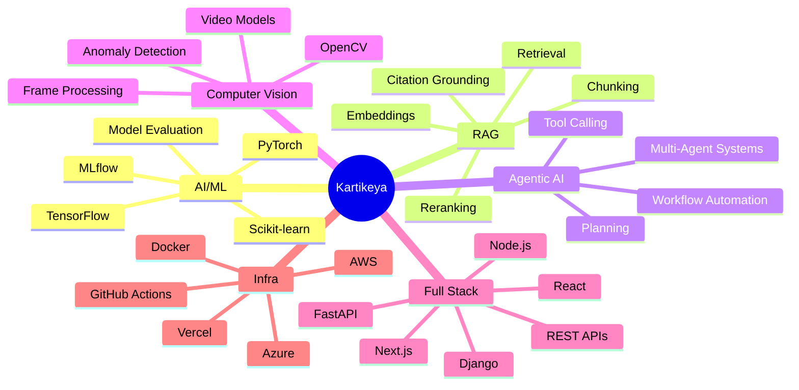
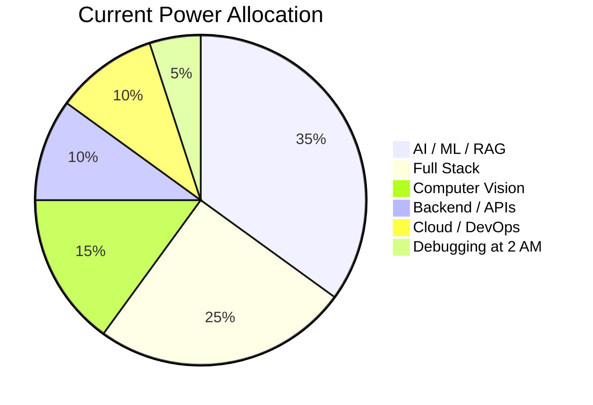

<!--
  FLASHY / ANIMATED / GITHUB-SAFE README
  Profile repository: KartikeyaM2007/KartikeyaM2007

  GitHub README reality check:
  - Custom CSS animations and JavaScript are blocked by GitHub.
  - The animations below use external animated SVG/GIF cards, which GitHub allows.
  - Snake section uses a safe static SVG so it does not break. For a personal contribution snake,
    add the workflow included separately as github_workflows_snake.yml.
-->

<div align="center">


[](https://git.io/typing-svg)


</div>

---
<div align="center">

## 🐍 Snake Game Repo View

<picture>
  <source
    media="(prefers-color-scheme: dark)"
    srcset="https://raw.githubusercontent.com/KartikeyaM2007/KartikeyaM2007/output/github-contribution-grid-snake-dark.svg?v=4"
  />
  <source
    media="(prefers-color-scheme: light)"
    srcset="https://raw.githubusercontent.com/KartikeyaM2007/KartikeyaM2007/output/github-contribution-grid-snake.svg?v=4"
  />
  
</picture>

</div>


## 🎮 Player Card

<table>
<tr>
<td width="50%">

### ⚔️ Identity Loadout

| Attribute | Value |
|---|---|
| 🧑‍💻 **Player** | Kartikeya Mishra |
| 🏷️ **Class** | AI/ML Developer + Full Stack Builder |
| 🧙 **Subclass** | RAG Wizard / Agentic AI Summoner |
| ⚔️ **Weapons** | Python, FastAPI, Next.js, PyTorch |
| 🛡️ **Armor** | Docker, GitHub Actions, Logs, Stack Traces |
| 🧟 **Enemies** | Hallucinations, 500 Errors, Broken Deployments |

</td>
<td width="50%">

### 🔥 Live Status

```text
KARTIKEYA.EXE initialized
HP:       ██████████ 100%
AI / ML:  █████████░  90%
RAG:      █████████░  90%
Vision:   ████████░░  80%
Backend:  █████████░  90%
Sleep:    ██░░░░░░░░  20%
Grass:    █░░░░░░░░░  10%
```

</td>
</tr>
</table>

---

## 🧙‍♂️ About Me


Hey, I’m **Kartikeya** — an **AI/ML Developer** and **Full Stack Builder** focused on **Agentic AI**, **RAG pipelines**, **Computer Vision**, **Machine Learning**, **Full Stack SaaS**, and **Cloud Deployment**.

I build projects that start as *“this idea is insane”* and somehow become *“wait, this actually works.”*

The model hallucinates. The backend panics. The frontend shifts by 2 pixels for no reason. The database silently judges everyone.

And yet... **we ship.** 🚀

<br clear="right" />

<div align="center">

[](https://linkedin.com/in/kartikeya-mishra-a92227191)
[](mailto:kartikeyamishra2134@gmail.com)
[](https://github.com/KartikeyaM2007)

</div>


<div align="center">

## 🧰 Inventory / Tech Stack

[](https://git.io/typing-svg)

### 🗡️ Languages

<br/><br/>


### 🧩 Frameworks & Libraries

<br/><br/>


### 🤖 AI / ML / Computer Vision

<br/><br/>


### 🏰 Databases / Cloud / Tools

<br/><br/>


</div>


<div align="center">

## 📊 GitHub Battle Stats


<br/><br/>


<br/><br/>


<br/><br/>


<br/><br/>


</div>
---

## 🕹️ Class Selection Screen

| Class | Role | Passive Ability | Ultimate |
|---|---|---|---|
| 🧙 **RAG Wizard** | Document intelligence | Extracts truth from PDFs | `Citation Storm` |
| 🤖 **Agentic AI Summoner** | Tool-using AI workflows | Automates repetitive pain | `Multi-Agent Swarm` |
| 👁️ **Computer Vision Hunter** | Pixel analysis | Detects anomalies in the wild | `Frame-by-Frame Judgment` |
| 🛡️ **Full Stack Tank** | Product engineering | Carries frontend + backend | `Deploy Without Fear` |
| 🧪 **ML Alchemist** | Model experiments | Turns tensors into predictions | `Gradient Descent Ritual` |

---

## 🧠 Skill Tree



---

## 📊 Brain Power Distribution



---

## 🧾 Quest Log

| Quest | Status |
|---|---|
| Build full-stack AI apps | ✅ Completed |
| Create RAG pipelines | ✅ Completed |
| Explore agentic AI workflows | 🟩 Active |
| Build computer vision systems | 🟩 Active |
| Learn federated learning | 🟨 In Progress |
| Improve production ML deployment | 🟨 In Progress |
| Defeat flaky dependencies | ♾️ Eternal Quest |
| Touch grass | ❌ Optional DLC |


## 🎮 Interactive Mini Game: Debug Boss Fight

<details>
<summary>🟢 <b>Level 1: API returns 500. Choose your move.</b></summary>

```text
A) Refresh repeatedly and hope
B) Blame the frontend
C) Check logs like a responsible engineer
```

✅ Correct: **C**  
Reward: `+10 sanity`, `+1 backend mastery`, `500 error took emotional damage`
</details>

<details>
<summary>🟡 <b>Level 2: RAG output is hallucinating. Choose your spell.</b></summary>

```text
A) Increase temperature because chaos is art
B) Improve chunking, retrieval, reranking, and context grounding
C) Tell users "it's a feature"
```

✅ Correct: **B**  
Reward: `+20 truthfulness`, `+15 retrieval accuracy`, `hallucination debuffed`
</details>

<details>
<summary>🔴 <b>Level 3: Production broke at 2 AM. Final boss music starts.</b></summary>

```text
Boss: NullPointerDragon
HP: 9999
Weakness: stack traces
```

Move sequence: `logs → reproduce → root cause → patch → test → deploy → pretend calm`

🏆 Victory unlocked: **Production Survivor**
</details>

<details>
<summary>🟣 <b>Secret Level: The model works locally but fails in deployment.</b></summary>

```text
Possible causes:
- Missing environment variable
- Wrong model path
- Memory limit
- Dependency mismatch
- The cloud simply woke up and chose violence
```

Reward: `+30 DevOps XP`, `+1 thousand-yard stare`
</details>

---

## 🏆 Achievement Unlocked

| Achievement | Description |
|---|---|
| 🧙 RAG Wizard | Built retrieval-based AI systems |
| ⚔️ API Knight | Survived REST API battles |
| 🐉 Bug Slayer | Defeated errors that had no business existing |
| 🧠 Tensor Tamer | Worked with ML models without crying publicly |
| 🏗️ Full Stack Builder | Built apps from database to deployment |
| 🚀 Ship Happens | Deployed projects despite the universe resisting |
| 🕵️ Log Detective | Found bugs through terminal archaeology |
| 🔥 Overengineering Enjoyer | Made the architecture 3x cooler than required |

---

<div align="center">

## 🧿 Developer Mood Board


</div>
